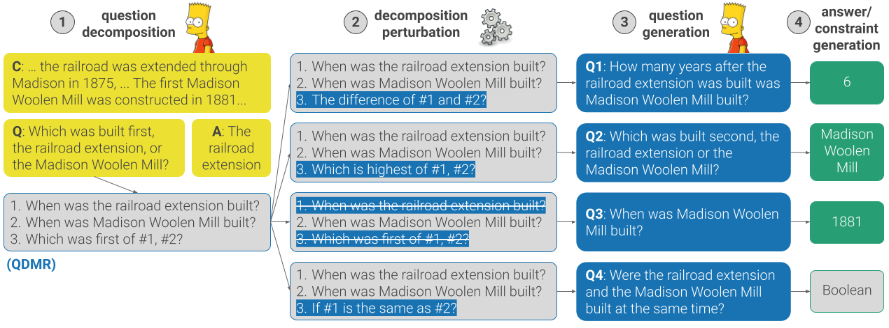

# _Break, Perturb, Build_: Automatic Perturbation of Reasoning Paths through Question Decomposition

This is the official repository for the paper "_Break, Perturb, Build_: Automatic Perturbation of Reasoning Paths through Question Decomposition", accepted for publication in Transactions of the Association for Computational Linguistics (TACL), 2021.

The repository provides the code of the BPB framework, and the generated evaluation sets.


<p align="center"></p>


## Setup

The framework and experiments described in the paper were conducted in a **python 3.6.8** environment.  To clone the repository and set up the environment, please run the following commands:
```bash
git clone https://github.com/mega002/qdmr-based-question-generation
cd qdmr-based-question-generation
pip install -r requirements.txt
python -m spacy download en
```


## 📦 BPB Models and Generated Data

### Models
BPB uses three models - a QDMR parser, a question-generation model, and a single-step QA model. 
To run BPB, uou can either train you own models, or download our trained models from these links:
- [QDMR parser](https://storage.googleapis.com/ai2i/bpb/QDMR_parser_BART.tar.gz)
- [Question generation model](https://storage.googleapis.com/ai2i/bpb/QG_BART.tar.gz)
- [Single-step QA model](https://storage.googleapis.com/ai2i/bpb/QA_RoBERTa.tar.gz)

To train a new model, run the script [train.py](run_scripts/train.py) while passing the relevant configuration file from [here](config). For example, to train a question-generation BART model, run the following command:
```bash
python run_scripts/train.py \
--config-file configs/q_gen_from_decomp/break_high_level.jsonnet \
--serialization-dir models/q_gen \
--gpu 0
```
Training the QDMR parser and the question-generation model requires the high-level part of the break dataset, which can be downloaded from [here](https://allenai.github.io/Break/#download). Our single-step QA model was trained on [SQuAD 2.0](https://rajpurkar.github.io/SQuAD-explorer/) and [BoolQ](https://github.com/google-research-datasets/boolean-questions) datasets.


### Generated Data
The evaluation sets generated with BPB for the development sets of DROP, HotpotQA, and IIRC are available for download under the [data](data) directory (one file per dataset). Each `zip` file includes the following files:
- `X_dev_contrast_set.json` - The generated contrast set.
- `X_dev_contrast_set_orig_subset.json` - The subset of examples from the original development set from which the contrast set was generated.
- `X_dev_contrast_set_sample_validated.json` - The subset of examples from the contrast set that were marked as valid by crowdworkers. 
- `X_dev_contrast_set_sample_validated_orig_subset.json` - The subset of examples from the original development set from which `X_dev_contrast_set_sample_validated.json` was generated.
- `X_dev_constraints.json` - The generated constraint set.
- `X_dev_constraints_orig_subset.json` - The subset of examples from the original development set from which the constraint set was generated.
- `X_dev_example_info_contrast_set.json` - Full example information for the generated contrast set examples.
- `X_dev_example_info_constraints.json` - Full example information for the generated constraint set examples. 


To run the BPB framework and generate new contrast/constraint sets, please keep reading. 


## ⚙️ Running BPB

BPB has 4 steps (illustrated in the figure at the top) of (1) representing questions as QDMRs, (2) applying transformations to the QDMRs, (3) generating a new question for each transformed QDMR, and (4) generating answers for the new questions. 
The following instructions describe how to execute each of these steps, using the models from [here](#models).

Currently, BPB can run on input files of two formats of DROP and SQuAD (we used SQuAD format for HotpotQA).

### (1) Generate QDMRs
The QDMR parser expects a `csv` file as input, where each row has a question ID in the first column and a question in the second column. The script `get_qdmr_parser_input_file.py` creates such input files for DROP, HotpotQA, and IIRC and can easily be adapted for other data formats. 

Running the QDMR parser can be done as follows:
```bash
python run_scripts/predict.py \
--model models/QDMR_parser_BART.tar.gz \
--data drop_dev_qdmr_input.csv \
--output-file drop_dev_qmdr_predictions.jsonl \
--gpu 0
```

Now, before applying perturbations to the predicted QDMR, convert the output predictions to a `csv` format:
```bash
python tools/qdmr_preds_jsonl_to_csv_file.py \
--predictions_path drop_dev_qmdr_predictions.jsonl \
--output_path drop_dev_qmdr_predictions.csv \
--fix_refs_back
```
The `fix_refs_back` flag is used when the QDMR parser makes use of special tokens in the QDMR structure (i.e. using `@@1@@` instead of `#1` as a reference to the answer of the first step). The QDMR parser used in our experiments used special tokens, which improved its performance.


### (2) Perturb generated QDMRs
To next step is to perturb the generated QDMRs by applying various transformations. This is done with the following script:
```bash
python qdmr_transforms/main.py \
--input_file drop_dev_qmdr_predictions.csv \
--output_file drop_dev_qmdr_perturbations.csv \
--dataset_name drop
```
Please note that in order to apply the `Append Boolean Step` transformation, an external file is needed that maps question IDs of questions with numeric answers to their answers. The file `numeric_qa_examples.json` in this repository includes this mapping for examples in DROP, HotpotQA, and IIRC.

### (3) Generate questions
Now we want to create new examples from the perturbed QDMRs. The first step is to map each perturbed QDMR to a new question, using our question-generation model. 
```bash
python run_scripts/predict.py \
--model models/QG_BART.tar.gz \
--data drop_dev_qmdr_perturbations.csv \
--output-file drop_dev_qmdr_perturbations_q_preds.jsonl \
--gpu 0
```

### (4) Generate answers
#### Generate intermediate-step answers using a single-step QA model
To have complete reading comprehension examples, we would also need to generate an answer for each question. To this end, we use a QA model that predicts the answer for every QDMR step, as follows:  
```bash
python -m src.models.iterative.run_model \
--qa-model-path models/QA_RoBERTa.tar.gz \
--q-gen-model-path models/QG_BART.tar.gz \
--qdmrs-path drop_dev_qmdr_perturbations.csv \
--orig-data-path data/drop_dataset/drop_dataset_dev.json \
--dataset-name drop \
--output-predictions-file drop_dev_perturbations_no_placeholders_qsteps.json \
--gpu 0
```

Note that the question-generation model is used here as well, to convert single QDMR steps from a statement format to a question format (e.g. "touchdowns that Rice scored" --> "What touchdowns did Rice score?").

#### Generate final answers and create example-info files
At this point, we have all the required information to create full examples (i.e. the perturbed QDMRs, the questions and the intermediate step-level answer predictions). The following script takes all this information, compute answers and answer constraints, and created an "example-info" file:

```bash
python example_generation/get_example_info_for_transformed_qdmrs.py \
--qdmrs_path drop_dev_qmdr_perturbations.csv \
--orig_data_path ../drop/drop_dataset/drop_dataset_dev.json \
--dataset_name drop \
--gen_qs_path drop_dev_qmdr_perturbations_q_preds.jsonl \
--pred_step_ans_path drop_dev_perturbations_no_placeholders_qsteps.json
```

The script will create four files of the generated contrast set, the generated constraint set, and the subsets of the original data from which these sets were generated.


## 📈 Evaluating QA Models

To evaluate QA models on our generated contrast sets/constraint sets, first download the data files of the relevant dataset from the [data directory](data). Otherwise, if you have generated your own data files, you can use the following script to create input files of a specific format from the example-info files created by BPB.

### Create DROP/SQuAD-format examples files
To create input files of a specific format, use the script `get_examples_from_example_info.py` as follows:  
```bash
python example_generation/get_examples_from_example_info.py \
--example_info_path drop_dev_example_info_contrast_set.json \
--data_format drop \
--output_path drop_dev_contrast_set.json
```

### Analyze QA model performance
The script `analyze_model_performance.py` takes as input prediction files in a `jsonl` format and analyze model performance across different perturbations and constraints. In addition, it compares model performance on the contrast set and the original subset of examples from which the contrast set was generated.


## ✍️ Citation

```bibtex
@inproceedings{geva2021break,
    title={Break, Perturb, Build: Automatic Perturbation of Reasoning Paths through Question Decomposition},
    author={Geva, Mor and Wolfson, Tomer and Berant, Jonathan},
    booktitle = {Transactions of the Association for Computational Linguistics (TACL)},
    year={2021},
}
```


